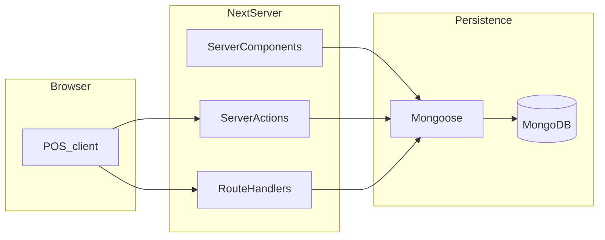
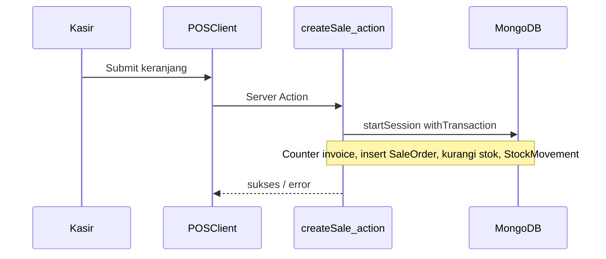

# Arsitektur aplikasi

## Ringkasan

Aplikasi adalah **monolith Next.js** dengan **App Router**: halaman dashboard mayoritas **Server Components** yang memanggil **Mongoose** langsung atau melalui **Server Actions** di [`src/actions/`](../src/actions/). Autentikasi memakai **NextAuth v5** (credentials + JWT). Beberapa interaksi realtime di browser (POS autocomplete) memakai **route handler** JSON + **SWR**.

## Alur penjualan (POS) ke data

## Integritas transaksi

Operasi yang menyentuh **stok + dokumen + log** (contoh penjualan [`createSale`](../src/actions/sale.ts), pembelian [`createPurchase`](../src/actions/purchase.ts)) memakai:

1. `mongoose.startSession()`  
2. `session.withTransaction(async () => { ... })`  
3. Pembaruan nomor urut melalui dokumen **Counter** dengan `findOneAndUpdate` + `$inc` di sesi yang sama agar nomor invoice tidak bentrok bila dua kasir mengirim bersamaan.

Jika langkah mana pun gagal, transaksi di-rollback sehingga stok tidak “nyangkut” setengah jalan.

## Audit

Mutasi penting dapat mencatat jejak ke koleksi **AuditLog** lewat [`writeAuditLog`](../src/lib/audit.ts) (actor, aksi, entitas, ringkasan). Halaman **Pengaturan → Log Audit** membaca data ini (hanya admin).

## Lapisan akses

- **Route grup** `(dashboard)` dan masing-masing halaman memanggil `requireAuth()` atau `requireAdmin()` dari [`src/lib/rbac.ts`](../src/lib/rbac.ts).  
- **Server Actions** yang memutasi master data memeriksa role admin sesuai kebutuhan domain.

## Dokumentasi terkait

- [SETUP.md](SETUP.md) — menjalankan & seed  
- [API.md](API.md) — endpoint HTTP di folder `app/api`  
- [USER_GUIDE.md](USER_GUIDE.md) — alur bisnis di UI
